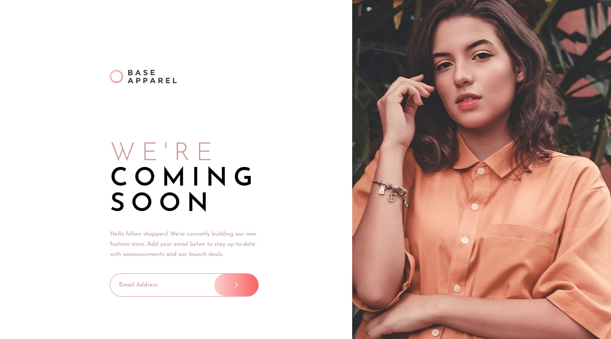

# Frontend Mentor - Base Apparel coming soon page solution

This is a solution to the [Base Apparel coming soon page challenge on Frontend Mentor](https://www.frontendmentor.io/challenges/base-apparel-coming-soon-page-5d46b47f8db8a7063f9331a0). Frontend Mentor challenges help you improve your coding skills by building realistic projects. 

## Table of contents

- [Frontend Mentor - Base Apparel coming soon page solution](#frontend-mentor---base-apparel-coming-soon-page-solution)
  - [Table of contents](#table-of-contents)
  - [Overview](#overview)
    - [The challenge](#the-challenge)
    - [Screenshot](#screenshot)
    - [Links](#links)
  - [My process](#my-process)
    - [Built with](#built-with)
    - [What I learned](#what-i-learned)
  - [Author](#author)
  - [Acknowledgments](#acknowledgments)

## Overview

### The challenge

Users should be able to:

- View the optimal layout for the site depending on ttheir device's screen size
- See hover states for all interactive elements on the page
- Receive an error message when the `form` is submitted if:
  - The `input` field is empty
  - The email address is not formatted correctly

### Screenshot




### Links

- Solution URL: [Frontend Mentor](https://www.frontendmentor.io/solutions/base-apparel-coming-soon-page-iM9dsGzYe6)
- Live Site URL: [GitHub Page](https://zenitsuag.github.io/base-apparel-coming-soon/)

## My process

### Built with

- Semantic HTML5 markup
- CSS custom properties
- Flexbox
- CSS Grid
- Mobile-first workflow
- [Vue](https://vuejs.org/) - JS framework
- [Tailwind CSS](http://www.tailwindcss.com/) - CSS framework
    
### What I learned

I learnt how to target specific breakpoints with Tailwind.
Here's how

```jsx
 <div class="hidden md:max-lg:block"></div>
```
This syntax here simply means the `div` will be hidden except when it's in the range of `md` to `lg` breakpoints. That is as long as the screen witdth is between `768px` and `1024px` this class of `block` will apply else the `div` will be `hidden`.

## Author

- Website - [Fred Robins](https://www.github.com/ZenitsuAg)
- Frontend Mentor - [@ZenitsuAg](https://www.frontendmentor.io/profile/ZenitsuAg)
- Twitter - [@yourusername](https://www.twitter.com/yourusername)

## Acknowledgments

- I give thanks to you, God Almighty for your grace and continuous support. Without you Lord Jesus, I wouldn't have come this far.